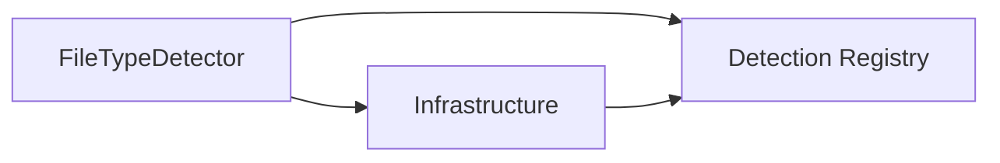

# Index - src/FileTypeDetectionLib

## 1. Purpose
Deterministische Erkennung und sichere ZIP-Verarbeitung.

## 2. Inputs
- Datei- oder Byte-Input via `FileTypeDetector`
- Sicherheits-/Policy-Optionen via `FileTypeDetectorOptions`

## 3. Outputs
- `FileType` (`Kind`, `Allowed`, Metadaten)
- Sichere Extraktionsergebnisse (Disk/Memory)

## 3.1 Core-Dateien im Modul-Root
| Datei | Rolle |
|---|---|
| `FileTypeDetector.vb` | oeffentliche API |
| `ZipProcessing.vb` | zentrale ZIP-SSOT (Pruefung + Extraktion) |
| `FileTypeDetectorOptions.vb` | Sicherheits-/Policy-Optionen |
| `FileTypeSecurityBaseline.vb` | konservative Default-Konfiguration |

## 4. Failure Modes / Guarantees
- Fehler => fail-closed (`Unknown` / `False`)
- Keine Namens-basierte Vertrauensentscheidung

## 5. Verification & Evidence
- `dotnet test FileClassifier.sln -v minimal`
- `bash tools/test-bdd-readable.sh`
- `bash tools/check-portable-filetypedetection.sh --clean`

## 6. Architektur-Chart

