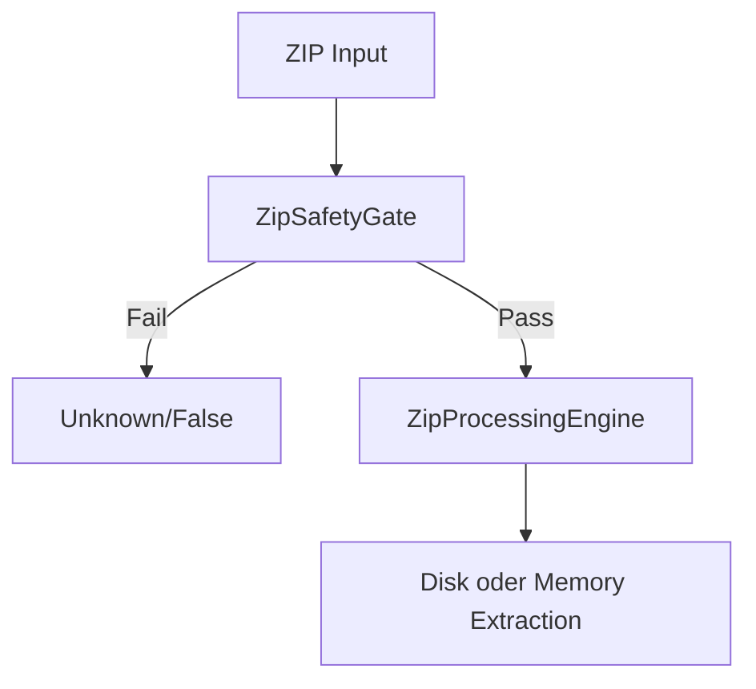

# Index - Infrastructure

## 1. Purpose
Sicherheitsnahe Stream-/ZIP-Infrastruktur.

## 2. Inputs
- Streams/Bytes aus API-Schicht
- Options-Limits

## 3. Outputs
- Validierte ZIP-Entscheidungen
- Sichere Extraktionsergebnisse

## 4. Failure Modes / Guarantees
- Traversal-/Bomb-Schutz aktiv
- deterministische Entry-Reihenfolge
- Ausnahmepfade fail-closed

## 5. Verification & Evidence
- `ZipAdversarialTests.cs`
- `ZipGatePropertyTests.cs`
- `ZipExtractionUnitTests.cs`

## 6. Sicherheitsfluss

