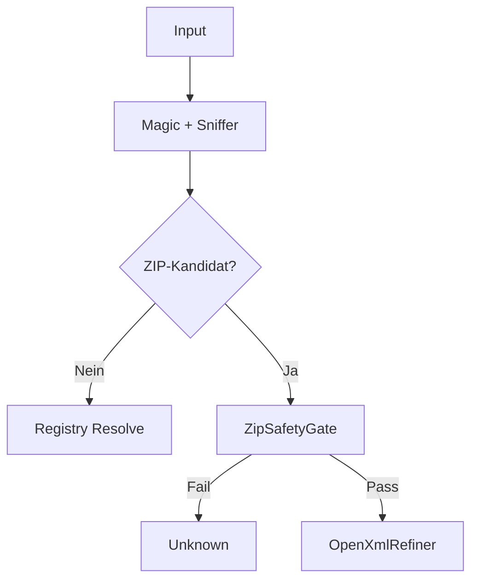

# FileTypeDetectionLib - README

## Zweck
Deterministische Dateityp-Erkennung mit fail-closed Sicherheitsgrenzen.

## Oeffentliche API (wann und warum)
| API | Zweck | Wann verwenden |
|---|---|---|
| `Detect(path)` | Inhaltsbasierte Erkennung | Standardfall |
| `Detect(path, verifyExtension)` | Erkennung + Endungs-Policy | Strikte Dateiendungsregeln |
| `Detect(data)` | Erkennung aus Bytes | Upload/In-Memory |
| `ExtractZipSafe(path, dest, verify)` | Sicheres Entpacken | Kontrolliertes ZIP-Handling |
| `SetDefaultOptions` / `GetDefaultOptions` | Optionen global verwalten | App-Start / Diagnostik |
| `FileTypeSecurityBaseline.ApplyDeterministicDefaults()` | Konservatives Sicherheitsprofil | Einheitlicher Produktiv-Start |

## Ablauf (kurz)

## Navigation
- [Abstractions/INDEX.md](Abstractions/INDEX.md)
- [Detection/INDEX.md](Detection/INDEX.md)
- [Infrastructure/INDEX.md](Infrastructure/INDEX.md)
