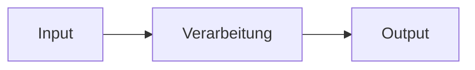

# <Modulname>

## 1. Zweck
Kurze Beschreibung der Verantwortung dieses Verzeichnisses.

## 2. Inhalt
Auflistung der zentralen Dateien/Klassen.

## 3. API und Verhalten
Beschreibung der relevanten Klassen/Funktionen und der erwarteten Semantik.

## 4. Verifikation
Konkrete Test- oder Prüfhinweise.

## 5. Diagramm

Wenn kein sinnvolles Diagramm möglich ist: `N/A` mit kurzer Begründung.

## 6. Verweise
Sprechende Links auf angrenzende Dokumente.
